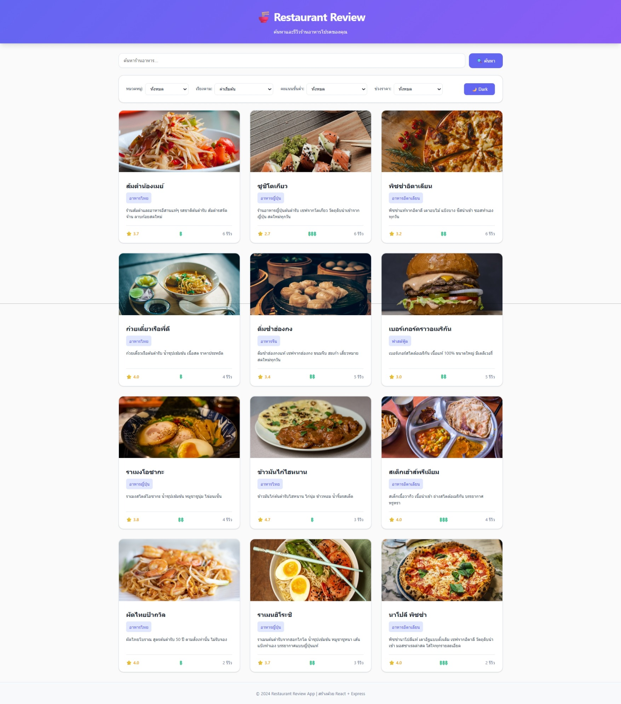
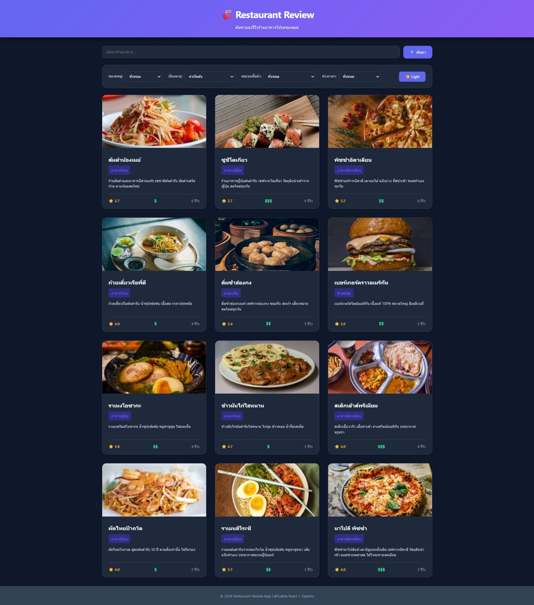
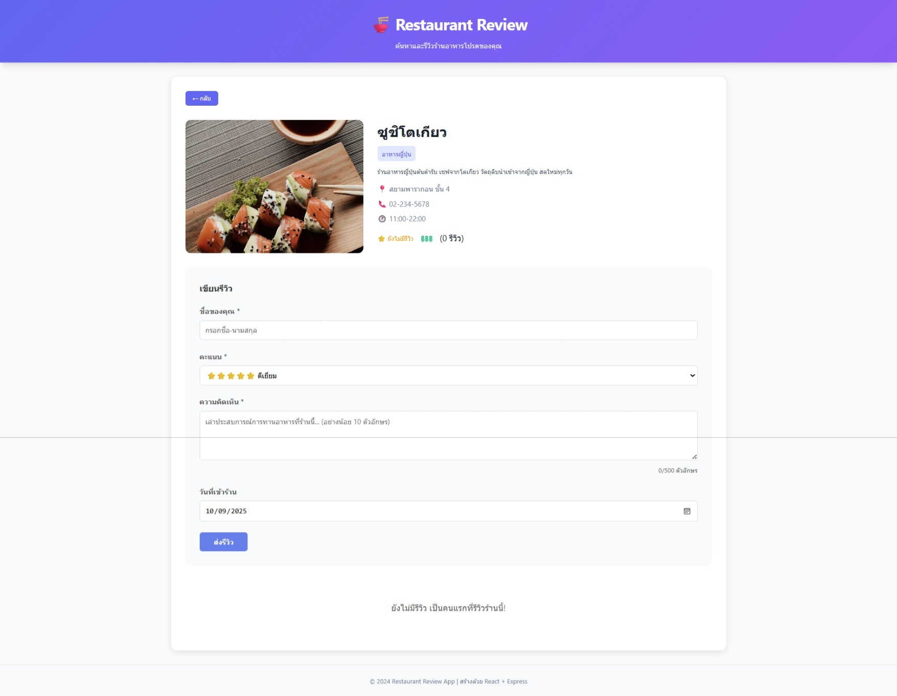
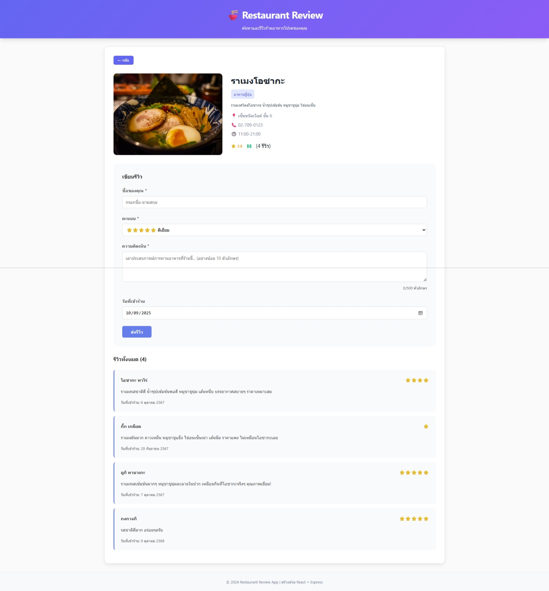

# Restaurant Review Website

## รายละเอียดโปรเจค
เว็บไซต์รีวิวร้านอาหารที่ให้ผู้ใช้สามารถค้นหาร้านอาหาร กรองข้อมูลตามหมวดหมู่ คะแนน ช่วงราคา ดูรายละเอียดร้าน และเขียนรีวิวร้านอาหารได้
ระบบจะคำนวณคะแนนเฉลี่ยอัตโนมัติและแสดงสถิติต่างๆ ของร้านอาหาร พัฒนาด้วย React และ Express.js พร้อมระบบ validation ที่ครบถ้วน

## โครงสร้างโปรเจค
```
restaurant-review-app/
├── backend/
│   ├── data/
│   │   ├── restaurants.json      # ข้อมูลร้านอาหาร
│   │   └── reviews.json          # ข้อมูลรีวิว
│   ├── routes/
│   │   ├── restaurants.js        # API endpoints สำหรับร้านอาหาร
│   │   └── reviews.js            # API endpoints สำหรับรีวิว
│   ├── middleware/
│   │   └── validation.js         # Middleware ตรวจสอบข้อมูล
│   ├── utils/
│   │   └── fileManager.js        # ฟังก์ชันจัดการไฟล์ JSON
│   ├── server.js                 # Main server file
│   ├── package.json              # Dependencies และ scripts
│   ├── .env.example              # ตัวอย่างไฟล์ environment
│   └── .gitignore                # ไฟล์ที่ไม่ต้องการ commit
│
└── frontend/
    ├── src/
    │   ├── components/
    │   │   ├── RestaurantList.jsx   # แสดงรายการร้านอาหาร
    │   │   ├── RestaurantCard.jsx   # การ์ดร้านอาหาร
    │   │   ├── RestaurantDetail.jsx # รายละเอียดร้านอาหาร
    │   │   ├── SearchBar.jsx        # แถบค้นหา
    │   │   ├── FilterPanel.jsx      # แผงกรองข้อมูล
    │   │   ├── ReviewForm.jsx       # ฟอร์มเขียนรีวิว
    │   │   └── ReviewList.jsx       # แสดงรายการรีวิว
    │   ├── services/
    │   │   └── api.js               # ฟังก์ชันเรียก API
    │   ├── App.jsx                  # Main App component
    │   ├── App.css                  # Styling หลัก
    │   └── main.jsx                 # Entry point
    ├── index.html                   # HTML template
    ├── package.json                 # Dependencies และ scripts
    ├── vite.config.js               # Vite configuration
    └── .gitignore                   # ไฟล์ที่ไม่ต้องการ commit
```

## เทคโนโลยีที่ใช้
**Frontend:**
- React 18 - JavaScript library สำหรับสร้าง User Interface
- Vite - Build tool และ development server ที่รวดเร็ว
- CSS3 - สำหรับจัดแต่ง UI พร้อม responsive design
- JavaScript ES6+ - ภาษาหลักของโปรเจค

**Backend:**
- Node.js - JavaScript runtime สำหรับ server-side
- Express.js - Web framework สำหรับสร้าง REST API
- CORS - จัดการ Cross-Origin Resource Sharing
- dotenv - จัดการ environment variables

**Database:**
- JSON File Storage - เก็บข้อมูลในรูปแบบ JSON files
- File System API - อ่าน/เขียนไฟล์แบบ asynchronous

## Features ที่ทำได้
### Required Features
- [x] แสดงรายการร้านอาหาร - แสดงร้านทั้งหมดพร้อมข้อมูลพื้นฐาน
- [x] ค้นหาร้าน - ค้นหาตามชื่อร้านและคำอธิบายแบบ real-time
- [x] กรองตามหมวด/rating/ราคา - กรองข้อมูลหลายเงื่อนไขพร้อมกัน
- [x] ดูรายละเอียดร้าน - แสดงข้อมูลครบถ้วนพร้อมรีวิวทั้งหมด
- [x] เพิ่มรีวิว - เขียนรีวิวพร้อมคะแนนและวันที่เข้าร้าน
- [x] Validation - ตรวจสอบข้อมูลก่อนบันทึกและป้องกัน XSS
- [x] อัพเดท rating อัตโนมัติ - คำนวณคะแนนเฉลี่ยใหม่เมื่อมีรีวิวเพิ่ม

### Bonus Features
- [x] Sort restaurants - เรียงลำดับตามคะแนน ชื่อ และจำนวนรีวิว
- [x] Responsive design - รองรับการใช้งานบนหน้าจอทุกขนาด
- [x] Animations - การเคลื่อนไหวและ transition ที่นุ่มนวล

## วิธีติดตั้งและรัน

### Backend
```bash
cd backend
npm install
cp .env.example .env
npm run dev
```

### Frontend
```bash
cd frontend
npm install
npm run dev
```

## API Endpoints
- GET `/api/restaurants` - ดึงรายการร้านทั้งหมด พร้อม query parameters (search, category, minRating, priceRange)
- GET `/api/restaurants/:id` - ดึงข้อมูลร้านตาม ID พร้อมรีวิวทั้งหมด
- POST `/api/reviews` - เพิ่มรีวิวใหม่พร้อม validation
- GET `/api/stats` - ดึงสถิติระบบ (จำนวนร้าน รีวิว คะแนนเฉลี่ย ร้านยอดนิยม)

## Screenshots
### หน้าแรก
- Light Mode

- Dark Mode


### รายละเอียดร้าน


### ฟอร์มรีวิว
- Review-ร้านราเมงโอซากะ

- Review-ร้านส้มตำน้องเมย์


## ผู้พัฒนา
- นาย ณัฐดนัย แปงจิตต์
- รหัสนักศึกษา : 68543210082-2
- Email : nutdanai@live.rmutl.ac.th

## License
MIT License